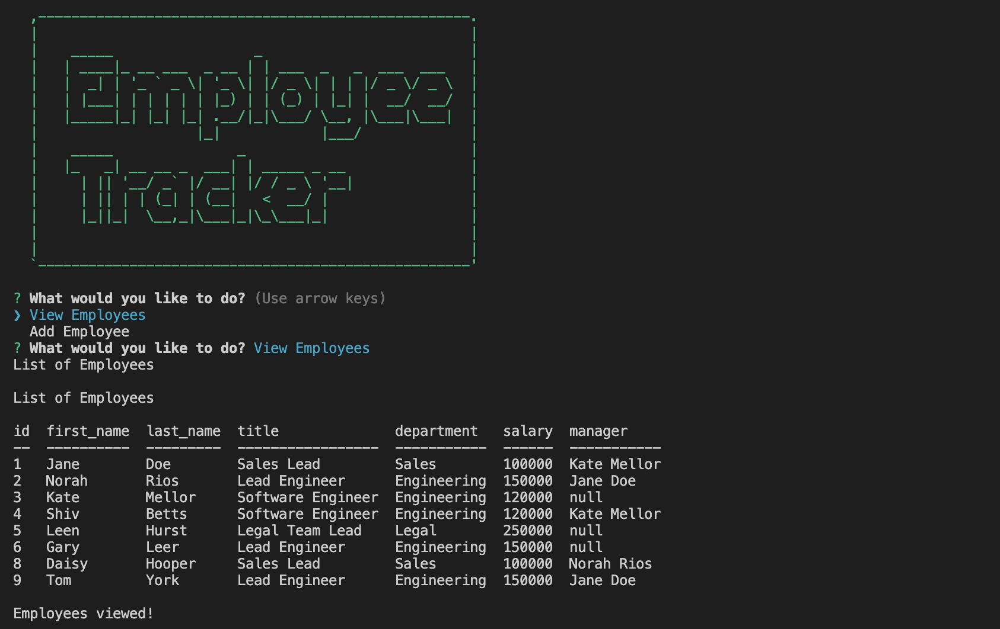

# Employee Database Assistant 

## Description

Employee Database Assistant is an app that lets the user to manage a database of all emplyees, departments and roles using a command. 
The user is presented with an easy to navigate command line interface with a set of questtions and answers. 
User can add or delete related, view databases of all employees, department and roles assigned with their supervisers/managers. 

## Installation
> npm install mysql2  
> npm install --save inquirer  
> npm install console.table  
> npm install asciiart-logo  
> npm install chalk@4.1.2

## Usage
To start using Employee Database Assistant user should use the following commands:  
> mysql -u root -p  
ENTER YOUR PASSWORD UPON REQEST  
> SOURCE db/schema.sql  
> SOURCE db/seeds.sql  
> npm start

## Screenshots/Video

Video presentation of application [Employee Database Assistant](https://)

Repo for app can be found at https://github.com/rroip/Employee-Tracker
